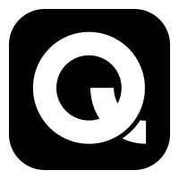

  
  <h1 align="center">QosmosUI</h1>

  
  

---

  A comprehensive and high-performance icon library for Blazor, inspired by react-icons.

---

## Documentation

Visit ~~[WIP]()~~ to view the documentation.

## NuGet Packages

### Main Package

| Package | Version | Downloads | Description |
|---------|---------|-----------|-------------|
| QosmosUI.Icons |  |  | Meta-package that includes all QosmosUI icon libraries |

### Individual Icon Libraries

| Package | Version | Downloads |
|--------------|---------------|------------------------|
| QosmosUI.Icons.AntDesignIcons |  |  |
| QosmosUI.Icons.BootstrapIcons |  |  |
| QosmosUI.Icons.BoxIcons |  |  |
| QosmosUI.Icons.CircumIcons |  |  |
| QosmosUI.Icons.DevIcons |  |  |
| QosmosUI.Icons.Feather |  |  |
| QosmosUI.Icons.FlatColorIcons |  |  |
| QosmosUI.Icons.FontAwesome |  |  |
| QosmosUI.Icons.GameIcons |  |  |
| QosmosUI.Icons.GrommetIcons |  |  |
| QosmosUI.Icons.HeroIcons |  |  |
| QosmosUI.Icons.IcoMoonFree |  |  |
| QosmosUI.Icons.Icons8LineAwesome |  |  |
| QosmosUI.Icons.IonIcons |  |  |
| QosmosUI.Icons.Lucide |  |  |
| QosmosUI.Icons.MaterialDesignIcons |  |  |
| QosmosUI.Icons.OctIcons |  |  |
| QosmosUI.Icons.RadixIcons |  |  |
| QosmosUI.Icons.RemixIcons |  |  |
| QosmosUI.Icons.SimpleIcons |  |  |
| QosmosUI.Icons.TablerIcons |  |  |
| QosmosUI.Icons.Themify |  |  |
| QosmosUI.Icons.TypIcons |  |  |
| QosmosUI.Icons.VsCodeIcons |  |  |
| QosmosUI.Icons.WeatherIcons |  |  |

## Contributing

Please read the [contributing guide](CONTRIBUTING.md).

## License

Licensed under the [MIT license](LICENSE).